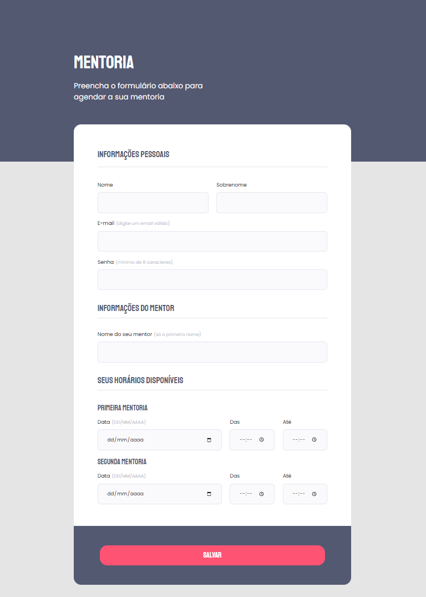

<h1 align="center">
  Formulario-Mentoria
</h1>

<h2 align="center" >Descrição do Projeto</h2>

  Formulario-Mentoria é o 1° desafio do Nivel 03 do programa Explorer da Rockeseat.
 

 

   

     Desafio tem como principal objetivo realizar a construção de um formulário totalmente do zero, apenas baseado em um protótipo passado pelo Figma, utilizando os conhecimentos adquiridos nas aulas do nível 03.
  

   
   

      
  

  
   
  
## 🔗 Link da aplicação no ar: https://formulario-mentoria.netlify.app/
  
## :rocket: Tecnologias

Esse projeto foi desenvolvido com as seguintes tecnologias:

✔️ HTML

✔️ CSS

✔️ Flex-box
